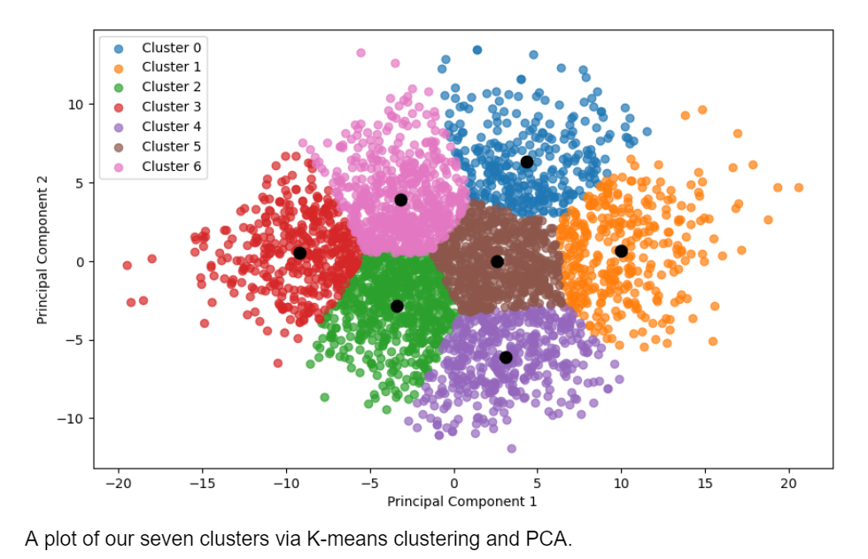
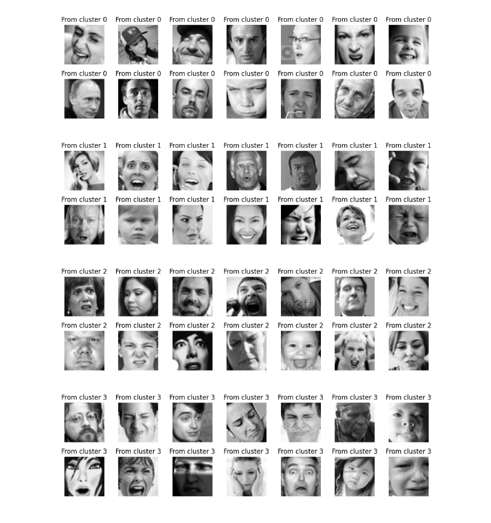
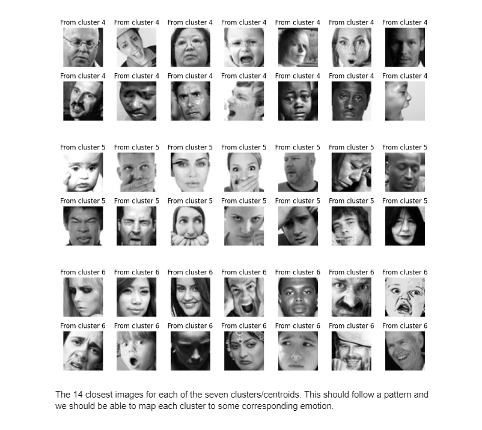

# machinelearning-project

## Introduction

Facial recognition technology is useful and can be applied to a wide range of applications. It can be used as a strong form of security and can enable developers to create potentially more convenient user interfaces. This makes creating a model for facial recognition important and useful for society.

Our dataset is named fer2013.csv and is a dataset that consists of 35,887, 48x48, pixelated images of varying people of varying emotions. As such, the dataset consists of 35,887 entries. Each entry has 3 columns: emotion, pixels, and usage. 

We aim to create an unsupervised model and that can classify human emotions by using k-means clustering and PCA. This means taking out the emotion encodings/column (at least) of the original dataset. 

We hope that the optimal number of clusters is 7 (like the original dataset, the number of emotions), which we then will manually assign each cluster an emotion label based on the closest images to each centroid. We then will assign the corresponding emotion to every image in that cluster and compare it with the original images in the dataset to see if the emotions are correct.

Creating a model for facial recognition is really cool to think about because a machine identifying faces and emotions was something unheard of in the early age of computers. Creating a somewhat successful model as a group of college students would be an achievement.

We wanted to test our technical abilities as well by choosing an unsupervised, image-based project rather than a supervised one based on continuous values. This would allow us to push our limits and give us more confidence for more difficult projects in the future.

The broader impact is that we could give anyone the ability to use our model and classify emotions with any image dataset they have. They would be able to train a model to recognize human emotions without much human input (just by uploading their image dataset)

## Figures

## Methods
### Data Exploration
Our dataset is named fer2013.csv and is a dataset that consists of 35,887, 28x28, pixelated images. As such, the dataset consists of 35,887 entries. Each entry has 3 columns: emotion, pixels, and usage. 

Each face is classified into one of 7 emotions: anger, disgust, fear, happy, sad, surprise, or neutral. An encoding for these goes into the emotion column for an entry. The pixel information for each image goes into the pixel column (a 48x48 image, so 2304 values should be in each entry's pixels column. Values range from 0-255). Usage is either training, public test, or private test, which is similar to saying which images should be used for training, validation, or testing.

The dataset contains a wide variety of faces, including individuals of varying ages, people with and without makeup, individuals from different racial backgrounds, actors, and even some instances of virtual avatars. In summary, this dataset offers a substantial and diverse collection of faces, making it highly valuable for training machine learning models.

The dataset consisted of 35887 images/entries. We found this through calling the len() function on the dataset. We found that each entry had 3 columns: emotion, pixels, and usage and found it through calling .columns on the dataset.

We confirmed that the dataset has seven encodings for each emotion by calling df[‘emotion’].unique(). We also confirmed that each pixel entry had 2304 different numbers, as our 48x48 image should have this much. We also confirmed that there were three different usages by calling df[‘Usage’].unique(),

We found that the emotion categories had a significant imbalance.  We did this through calling df.emotion.value_counts() and found that emotion 3 (happy) had significantly more images than the emotion 1(disgust), with 8989 and 546 images respectively.

There were no null/nan values as well, which we confirmed with .isna(). We called .dropna() for good measure afterwards.

Lastly, we plotted images from each emotion category to ensure there were no deformities and that each image was appropriately labeled. We created a function called displayClasses and basically plotted two images from each emotion category. We scanned our dataset for the first two occurrences, and implemented plot/subplot to get all images into one plot.

Link to database: https://ufile.io/40nmtjlw

### Data Preprocessing
We found that the dataset was mostly preprocessed already.  The images have been compressed to be 48 x 48 and have already been converted to greyscale. 

Because our dataset was quite large (at around 36k images), we decided to cut down on it. We decided to get 547 images from each of the seven emotions, totalling at 3829 images for our model to train and test on. 

As a result, we created a script that could get x images from each emotion category (we could set x to anything in case we felt like we needed more images). Our cut down dataset would be contained in a csv called ‘face-emo.csv’ which we then would normalize.

We also normalized all pixel values. This was done using min max scalar.

We also dropped the emotion encoding and usage columns of the dataset. 

### Model 1 Ver. 1
Our first model would be focused around K-means clustering and seeing if we should use either an SVD or PCA approach.

To test the quality of clustering in machine learning, silhouette scores are often calculated. We decided to test the silhouette scores of both an SVD and PCA approach. They were very similar, with PCA being slightly better, so we clustered according to PCA.

We then wanted to check the optimal number of components and clusters for our dataset after our initial clustering with PCA. We set a range for the number of principal components (2-5) and the number of clusters (5-15) to see if our model could potentially spot other emotions. Any combination that would increase our silhouette score would be the one that we would use, with us using cross validation on top of this. 

In the end, everything gave a roughly similar silhouette score (around .33) so we decided to go with our initial 2 principal components, 7 cluster plot.

We then plotted random images from each cluster and see if any cluster followed an inherent pattern or similar emotion. We then plotted the 14 images closest to each cluster centroid to see if the emotions shown would be similar. Ideally, those closest to the centroid would show similar emotions, as their principal components should be the same.

We then used the plots of the above images and manually mapped a cluster back to a certain emotion. This was based on what we saw the most. We then applied an emotion label back to all images based on which cluster they belonged to.

We then called accuracy_score to compare how our model clustered each image according to PCA (with our manual labels) with the original dataset’s emotion labels. Any mismatch would lead our accuracy to be lower and any match would lead our accuracy to be higher.

### Model 1 Ver. 2
We were originally going to try and create a new model that would be a convolutional neural network. However, due to time constraints, we tried our best to up the accuracy of our previous model.

There’s not much that was significantly different from the first model other than various optimizations. We didn’t truncate as much information when compared to the first version. Our version 1 had 3829 entries, as we got 547 images from each emotion. Instead, we upped it to 4000 images per emotion for a total of 24547 images (emotion 1 only had 547, which is why it totaled to this). This was possible due to the script we made.

There were also optimizations in some of the code. We optimized the code for the images closest to each cluster centroid and the error analysis code.

Other than the above, version 2 is almost identical to version 1.

## Results
#### DUMP OUT THE RESULTS HERE BUT DONT TALK ABOUT THEM, ADD DIAGRAMS OF RESULTS, THE CLUSTERING DIAGRAM, OR OTHERS THAT SHOW OUR RESULTS
#### LAST PARAGRAPH HERE IS ABOUT THE FINAL MODEL AND FINAL RESULTS SUMMARY

### Data Exploration

### Data Preprocessing

Our dataset before:

Our dataset after, normalized and truncated to 547 entries from each emotion:

Note: We would upload the csvs themselves but Github says the files are too large. If you'd like more details, refer to the first part of PreprocessingAndFirstModelBuildingMilestone.ipynb

### Model 1 Ver. 1

Silhouette score using SVD:  0.33141524771150843

Silhouette score using PCA:  0.33614953536518816

The 14 closest images to each cluster centroid

Classification Accuracy: 14.553836022390518

Note: Refer to PreprocessingAndFirstModelBuildingMilestone.ipynb for specific code and the above information. Obviously will randomize depending on the split and how our script grabs from the dataset.

### Model 1 Ver. 2
Silhouette score using SVD:  0.32887400851623083

Silhouette score using PCA:  0.33287600572702764

The 30 closest images to each cluster centroid

Classification Accuracy: 14.84351261014889

Note: Refer to FinalModelProject.ipynb for specific code and the above information. Obviously will randomize depending on the split and how our script grabs from the dataset.

## Discussion
#### TALK ABOUT THE RESULTS HERE, AND OUR THOUGHT PROCESS BEGINNING TO END. REALLY THINK IN THIS SECTION AND SHOW HOW YOU THINK SCIENTIFICALLY 
### "This will mimic the sections you have created in your methods section as well as new sections you feel you need to create."
### Data Exploration
Overall, this dataset should have not provided any problems in making a successful model. There’s great variety in the images, and all images should be labeled accordingly. There were actors, famous politicians, virtual avatars, people of varying ages, etc., so there should be no issues in the quality of the image dataset.

If there are errors in the labeling of images, the overall size of the dataset (35557 images) should be enough to outweigh those misclassifications (given the total is small relative to the size of the dataset). The probability that we grab the majority of misclassifications into our ‘face-emo.csv’ is also relatively low due to the number of images we grab in our script.

The dataset itself was used in numerous other models as well with high accuracies, so it’s very hard to attack the quality of the dataset. In other words, the reason for a faulty or lacking model would least likely be from the quality of the dataset itself.

### Data Preprocessing
Considering the imbalance in the number of images in our emotion categories (our largest emotion category had 8989 images and the smallest had 547), we thought using a script to cut down our dataset would be for two main benefits. 

The first was to speed up any computations we had to do. This would be important because we would end up taking out the emotion labels, cluster all images, reapply an emotion label manually, and then cross reference that back with the original dataset. This equates to touching each entry at least 4 times (at the best case) meaning that we would have to do a modification or compare 144,000 times.

The second reason was to eliminate any potential bias, as the model may train too much on a specific emotion and not another.

This was a huge oversight for us, as we effectively cut our 36k image dataset all the way down to a 4k image dataset. With a split as well, this would mean that the model would have even less data to train on.

The reason for our accuracy being so low for the first model could be because of how small we made our dataset, as the model just didn’t have enough faces to train on. A model should have a large amount of data to train on regardless of supervised or unsupervised.

As a result, we expanded it from 547 images of each emotion to 4000 of each (giving us 24547 images). Emotion 1 doesn’t have that many (547 images only), but sacrificing a bit of bias is worth it, because it ensures that the model will train more intensively and accurately.

The reason for normalizing was to make the pixel column more readable, and less grayscale intensity with numerous images may help with overall speed as normalizing may help with analyzing principal components in the PCA process. We could similarly divide each value by 255 and convert each to a float, as grayscale pixel values range from 0-255.

The reason we dropped the emotion encoding column of the dataset was because we were planning to do an unsupervised approach on the dataset. The intention was to see if our model could potentially categorize these emotions back together.

There was some debate in our group whether we should have left the usage column in or not. Those in favor (wanted to drop) wanted to avoid any bias by dropping the usage column. A good model should be able to train on whatever data was given, not carefully crafted/specific ones from a huge dataset. Those against (wanted to keep it) said that validation would help the training greatly, and that the authors of the dataset painfully labeled each and every image to use for training, validation, or testing purposefully. We ultimately dropped it in our first model. 

Our dataset being cut down significantly is probably more responsible for our low accuracy in the first model than not having validation, as there are high accuracy models out there that don’t use validation in the first place.

### Model 1 Ver. 1

There were concerns about the size of our dataset after preprocessing, as we cut down our 36k dataset to a 4k dataset. With the train test split as well, the number of entries that the model would train on would be even smaller. This would end up not mattering, as in version 2 we made the dataset bigger but still had a very low accuracy.

An interesting thing that our results showed was that our accuracy was about 14. This is 100/7. This suggests that our model is completely random, or is simply guessing, in what images belong to what clusters. In other words, the model is bound to get 1/7 correct if we only have 7 classes. This leads to the possibility that something is simply coded wrong in our model since the logic of using K-means with PCA is sound.

We could criticize the use and effectiveness of using PCA and K-means clustering in facial recognition. However, PCA is pretty good for facial recognition as there are numerous models out there already published that use this type of model for facial recognition. 

The truth is that we made a huge oversight in selecting K-means and PCA for this dataset. We realized it after the creation of this model. K-means and PCA are good for facial recognition, but what that means is that a much better dataset for this model would be a dataset of faces and no faces. Instead, we have a dataset of all faces, but with different facial emotions.

What’s most likely going on is that our PCA is getting principal components that aren’t useful enough. The faces in this dataset are of similar shape, have similar features (eyes, mouth, ears, etc.) and only slight deviations occur in skin color or angle of face. These principal components are too similar to another or that there’s not enough to go off of in distinguishing emotions. 

There’s a possibility of increasing the number of principal components and so that the model could find things that distinguish emotions. However, this would greatly increase computation time, and what we could instead do is implement convolution neural networks.

A change we could do ( is that we could’ve created a convolutional neural network instead. Convolutional neural networks are great for facial recognition as they can use filters to identify specific features in people’s faces, and as a result can identify different features when it comes to people’s emotions. However, we really wanted to do an unsupervised approach and using a CNN would then make us transition to a supervised approach.

### Model 1 Ver. 2

Even though we upped the dataset size used from version 1 to version 2 (3829 images to 24547 images), we didn’t see any significant changes in the accuracy. Our version 2 only had its accuracy increased by about .3, totalling to an accuracy of 14.84351261014889. 

The reason for this small number is the same as our version 1. Our model most likely can’t decipher and distinguish between these emotions and is randomly assigning an emotion into one of the 7 clusters. Our upped dataset probably doesn’t do anything as well, as it’s entirely possible that the slight increase in accuracy was by chance due to the randomized data the script gets from the dataset and the randomized split.

It’s once again realistically possible that something in our model was not coded properly too, despite our checks, rereads, and troubleshooting of the code. This is something none of us have ever coded before, so it’s possible that mistakes were made there.

The reason for the failure in this model is due to the fact we’re applying the wrong type of model to the wrong type of problem. PCA is more useful in facial recognition, distinguishing between faces and non-faces. However, our type of problem is not just facial recognition. It’s detecting certain emotions from faces, which is a step up between distinguishing faces and non-faces. A convolutional neural network would’ve been a much better model for this type of problem as we can identify certain facial features from different emotions (like furrowed brows or a wide grin) through filters.

## MOVE THIS/COMBINE/REMOVE ACCORDING TO THE SECTIOSN ABOVE. DISCUSSION NEEDS TO HAVE SECTIONS THAT MIRROR THE PREVIOUS ONES.
In the preprocessing step, we decided to only grab 547 sample images from each class of emotion because one of the classes of emotion only had 547 sample images. Initially, we wanted more than 547 samples to train the model but having more than 547 samples will lead to bias in our model. Therefore, we only have 547 samples from each emotion class. The data was already downsized and gray-scaled so there wasn’t any other thing we would have done other than normalizing the pixels values of each image and dropping the columns “emotion” and “usage”. The column “emotion" is the classification of each image and the “usage” columns specify whether the image will be used for testing or training. We don't need these columns because we are doing unsupervised ML to classify each image and doing our own splitting of the images for testing and training. Before we do any machine learning, we wanted to check and remove any null data so it won’t impact the results of our model. 

Our first model was not that great. The images closest to the centroids of each cluster seem to have no relationship to each other in human eyes but there is some patterns and relationship that only a computer can see. This is to say that there exists some underlying relationship between each image that could be used to better classify the images. We tried printing out more and more of each image at the centroids of each cluster but it seems like every image’s emotion is pretty much random to the naked eyes even though they are images from the centroid of each cluster and should have some relationship to each other. This could mean that the computer may have came out with different kind of classification that we are unaware of. For example, emotions like angry, sad, or happy is obvious to humans but to computer, it is entirely different. Therefore, we concluded that these emotions classification is something only computer can understand what it means and impossible for humans to understand these classification. Out of curiosity, we try a larger set of data to see if it yields better accuracy. And it did! But it only improved the accuracy by a little bit. 

Since we are going for an unsupervised approach we don't really have a true over/underfitting situation so we attempted to compare the clusters to the original dataset. We mapped out our clustered images to the emotions from the original dataset. This was done by plotting a random set of images from each cluster and then mapping out each emotion visually to their respective original emotion. This process was challenging because the clustering wasn't great so we mapped to the emotion that was most dominant. We got an accuracy of about 14% meaning that there was little correlation to the original emotions. Our next steps are to improve the model to increase our silhouette score, which in turn might increase the classification accuracy of the model.

## Conclusion
#### WRAP UP, MIND DUMP, OPINIONS FUTURE PLANS, WHAT WOULD WE DO DIFFERENT.

The result that we got wasn't quite what we would have liked to see. For example, our accuracy was low and after some messing around, we were only able to increase the accuracy by a little. We realized that 547 samples from each class is pretty small and as a result, we have cut down the size of our dataset by a significant amount. However, allowing more samples did not make a huge impact on our accuracy, refer to model 2. Thus, it seems that we may have to look at other models such as HOG and LBP. Given the fact that summer session is short, we will not have time to try these models. However, we may work on this project even after summer is over.

## Collaboration
#### EVERYONE WILL FILL THIS PART OUT FOLLOW EXAMPLE...
### Start with Name: Title: Contribution. If the person contributed nothing then just put in writing: Did not participate in the project.
### Dillon Jackson: Wroked on the readme, accuracy testing, and project facilitation 
### Billy Ouattara: Wrote the script for balancing the different type of images, and built the initial unsupervised model.
### Raphael Talento: Report, wrote code for images closest to each centroid, data exploration
### Tou Yang: Worked on the Report, readme, replicating and analyzing results, setting up meeting time, help with calculating the error of the model. 
